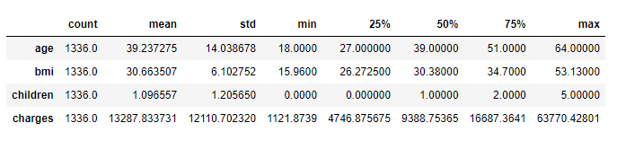
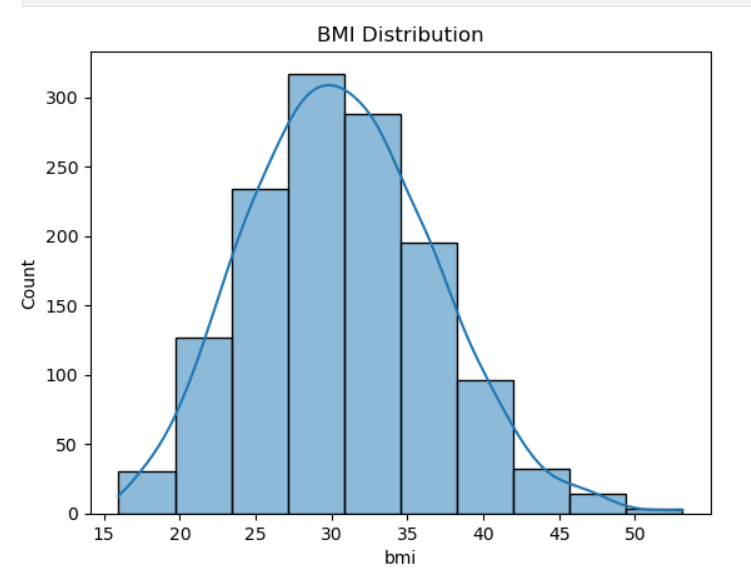
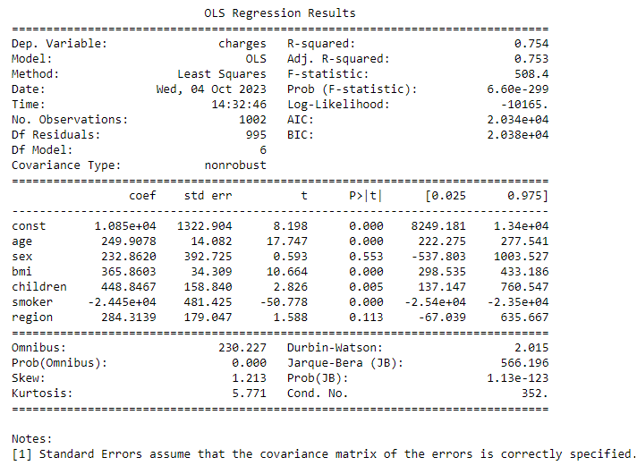
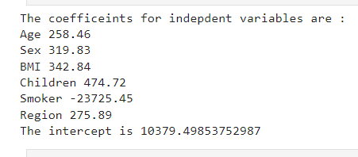
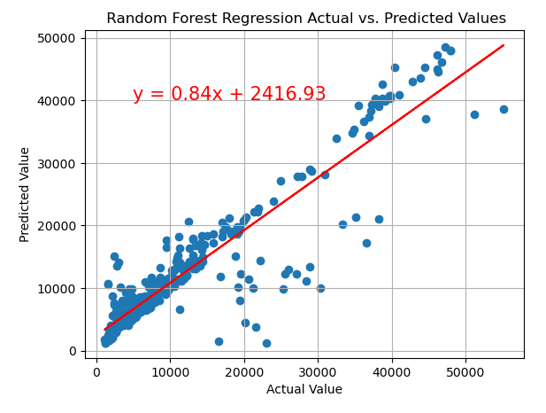

# Health Insurance Cost Prediction

## Overview:
Determining the premium for a health insurance policy involves a nuanced evaluation of various factors unique to each individual. One such influential factor is age, where the likelihood of major health issues increases with age. Consequently, older individuals are expected to pay higher premiums compared to their younger counterparts, reflecting the potentially greater healthcare expenses associated with aging.

Beyond age, numerous other variables contribute to the computation of health insurance premiums. This project aims to demystify the process of predicting health insurance premiums through machine learning techniques using Python. By leveraging a dataset encompassing diverse factors, we seek to build a robust model that accurately forecasts the premium associated with an individual's health insurance policy

## Notebook Content:
- **Step 1**: Install and import necessary libraries
- **Step 2**: Reading and exploring data
- **Step 3**: Data cleaning and preprocessing
- **Step 4**: Descriptive Statistics
- **Step 5**: Data Analysis and visualization
- **Step 6**: Predictive models  

## Libraries Needed:

- pandas
- matplotlib
- seaborn
- numpy
- scipy.stats
- sklearn - linear regression, train_test_split, RandomForestRegressor
- statsmodels

## Introduction:

The dataset used contains the following features :   
1. The age of the person
2. Gender of the person
3. Body Mass Index
4. Number of children the person is having
5. If the person smokes or not
6. The region where the person lives
7. The charges of the insurance  

## Data Cleaning and Manipulation:

- The dataset was consists of 1338 rows and 7 columns, it didn't have any null values.
- It comprises of 3 categorical features and 4 numerical features.
- Utilizing `info` gives us an overview of the size of our dataset, any missing values and the data types of our columns.
- Upon inspection, a duplicated value was identified, addressed by storing it in a variable and negating it using `isin`, then verified

## Descriptive statistics:

- To understand the basic characteristics of our data, we can use the `describe` method which returns the following 
  

## Visualizations:

- Various visualizations were generated for insight into different dataset columns.  

  

## Data Preprocessing:

- To handle categorical values, encoding was applied, replacing category names with numerical values (e.g., 1, 2, 3, 4)

## Analysis:
### OLS Regression
- Ordinary Least Squares is used to determined the relationship between 1 or more independent variables and a dependent variable.  

- The following can be interpreted from the OLS Regression Results:

- The accuracy of the model is 75%
Our Prob(F-Statistic) value is very low implying that overall the regression is meaningful

### Linear Regression:

 - On performing linear regression on our dataset we got the following results:
 

 ### Random Forest Regression:

 - Random Forest Regression gives us the best performance with a R2 Value of 98%
 

### Conclusion:

- The premium amount of a health insurance policy depends on person to person as many factors affect the premium amount of a health insurance policy

### Credits:

- [Readme/Analysis](https://thecleverprogrammer.com/2021/10/26/health-insurance-premium-prediction-with-machine-learning/)
- [Debugging](https://github.com/akashdeep364/Medical-Insurance-Cost-Prediction/tree/main)

